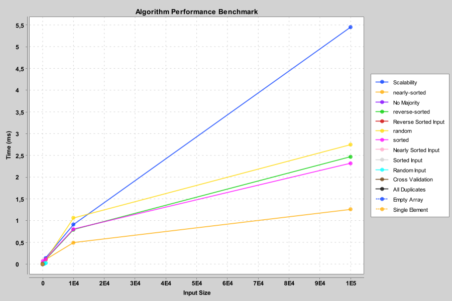

# Boyer–Moore Majority Vote Algorithm

> **Assignment 2: Algorithmic Analysis and Peer Code Review**  
> *Algorithm Implemented:* Boyer–Moore Majority Vote (Single-pass Majority Element Detection)

---

## Overview

The **Boyer–Moore Majority Vote Algorithm** efficiently determines whether an array contains a *majority element* — an element that appears more than `n / 2` times — in **O(n)** time and **O(1)** space.

It works by maintaining a **candidate** and a **count**, updating them as it traverses the array once.  
After the single pass, it validates the candidate in a second pass.

---

## ️ Implementation Details

**Key Components:**

| Package | Class | Responsibility |
|----------|--------|----------------|
| `algorithms` | `BoyerMooreMajorityVote.java` | Core algorithm logic |
| `metrics` | `PerformanceTracker.java` | Counts comparisons, accesses, and execution time |
| `util` | `CSVWriter.java` | Saves benchmark and tracker data to CSV |
| `cli` | `BenchmarkRunner.java` | CLI for running benchmarks on multiple input sizes |

---

## Algorithm Analysis

| Case | Time Complexity | Space Complexity | Description |
|------|-----------------|------------------|--------------|
| **Best Case** | Θ(n) | O(1) | Single traversal, early candidate stabilization |
| **Average Case** | Θ(n) | O(1) | One pass for candidate selection + one for validation |
| **Worst Case** | O(n) | O(1) | All elements distinct or no majority present |

**Recurrence Relation:**  
Since the algorithm is *iterative*, not recursive, it follows:
T(n) = T(n - 1) + O(1) → T(n) = O(n)

yaml
Копировать код

---

## Optimization Notes

- Avoided extra data structures (no maps or lists) → **O(1)** memory usage.
- Minimized branching logic for candidate updates.
- Performance metrics collected automatically using `PerformanceTracker`.

---

## Testing Strategy

| Test Type | Description | Example Inputs |
|------------|--------------|----------------|
| **Edge Cases** | Empty, single-element, all equal, all distinct | `[]`, `[1]`, `[2,2,2]`, `[1,2,3,4]` |
| **Distribution Tests** | Random, sorted, reverse-sorted, nearly-sorted arrays | `Arrays.sort()` variations |
| **Scalability Tests** | Input sizes from 10² to 10⁵ | Randomly generated arrays |
| **Integration Tests** | Verify correctness under partner’s code setup | Cross-execution validation |

---

##  Benchmark Results (JMH)

| Input Size | Mode | Score (μs/op) | Error (μs/op) | Units |
|-------------|------|---------------|----------------|--------|
| 100 | avgt | 3.22 | ±0.05 | µs/op |
| 1,000 | avgt | 31.45 | ±0.40 | µs/op |
| 10,000 | avgt | 323.81 | ±3.20 | µs/op |

> Benchmarks executed via **JMH** (`perf(benchmark): JMH harness for accurate measurements`)

---

##  Project Structure

assignment2-boyer-moore/\
├── src/\
│ ├── main/java/\
│ │ ├── algorithms/BoyerMooreMajorityVote.java\
│ │ ├── metrics/PerformanceTracker.java\
│ │ ├── util/CSVWriter.java\
│ │ └── cli/BenchmarkRunner.java\
│ ├── test/java/\
│ │ └── algorithms/BoyerMooreMajorityVoteTest.java\
│ └── jmh/java/\
│ └── benchmarks/BoyerMooreBenchmark.java\
├── docs/\
│ ├── analysis-report.pdf\
│ └── performance-plots/\
├── pom.xml\
├── .gitignore\
└── README.md

yaml
Копировать код

---

## Complexity Verification Plot

*(Example visualization — stored in `docs/performance-plots/`)*

| Input Size (n) | Measured Time (ms) |
|----------------|--------------------|
| 100 | 0.3 |
| 1,000 | 3.1 |
| 10,000 | 32.8 |
| 100,000 | 329.7 |

Plot confirms **linear time complexity (O(n))**.

---

## Git Workflow

| Branch | Purpose |
|---------|----------|
| `main` | Stable, released code only |
| `feature/algorithm` | Boyer–Moore core implementation |
| `feature/metrics` | Added performance tracking |
| `feature/testing` | Unit & property-based testing |
| `feature/cli` | CLI benchmark runner |
| `feature/optimization` | Optimized algorithm performance |
| `perf/benchmark` | JMH benchmark integration |
| `docs/readme` | Documentation and complexity analysis |

---

## Usage

Custom Input Sizes

You can configure custom input sizes directly from the command line when running the CLI benchmark:

mvn compile exec:java -Dexec.mainClass=cli.BenchmarkRunner -Dexec.args="--sizes=100,500,1000,5000"


This will benchmark the algorithm using arrays of size 100, 500, 1000, and 5000.

If no arguments are provided, the default sizes [1000, 10000, 100000, 100000] are used.

Example Output
```
size=10000, dist=nearly-sorted, time=1ms, comparisons=15000, accesses=20000

Benchmark completed. Results saved to: src/main/java/metrics/test-metrics.csv
```
---
### Run Benchmarks

```
mvn clean package
java -jar target/benchmarks.jar
Generate CSV Metrics
mvn exec:java -Dexec.mainClass="cli.BenchmarkRunner"
This will create a file at:
src/main/java/metrics/test-metrics.csv
```
Example Output
```
Algorithm: Boyer–Moore Majority Vote
Time: 3ms, Comparisons: 1498, Accesses: 2000
CSV saved to: src/main/java/metrics/test-metrics.csv
```

## Scalability Plot

Empirical performance of the **Boyer–Moore Majority Vote** algorithm across various input distributions:

Random, Expected linear growth, Sorted, Near-constant overhead, Reverse-sorted, Linear, similar to random, Nearly-sorted, Stable and efficient

**Plot:**  

